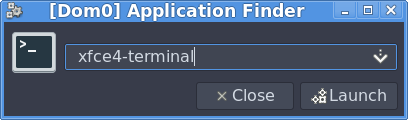
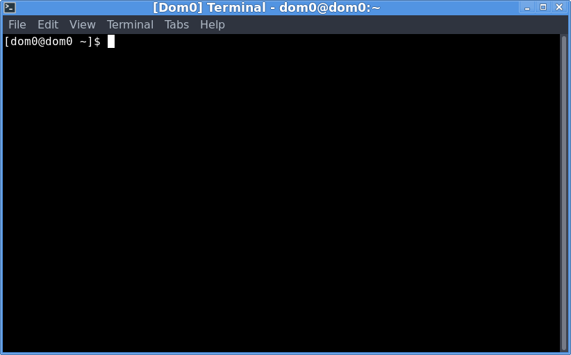
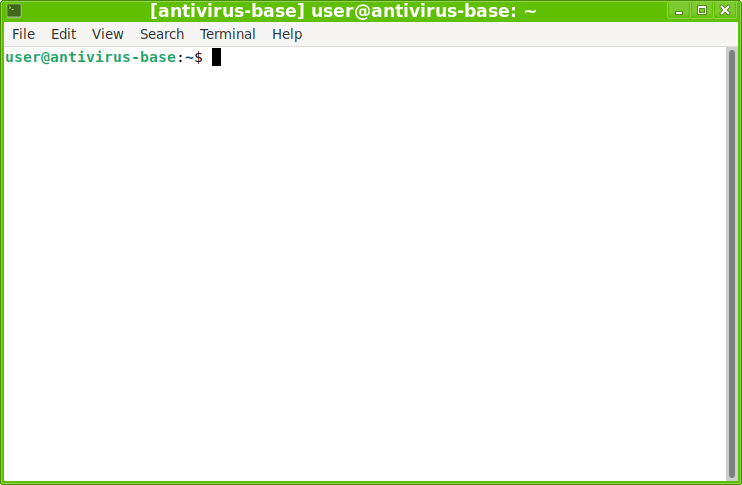

# Антивирус в песочнице

Антивирусы в Linux - не диковинка. Но обитают они зачастую на узлах передачи почты, файловых
хранилищах и т.п. На серверах, одним словом. На настольных компьютерах как-то не сложилось...
Притом, что возможностей хоть отбавляй. Можно установить антивирус прямо на физическую машину (и
даже включить сканирование "на лету"). Можно развернуть в Docker-контейнере. Про виртуальную машину
говорить нечего.

Но всё это скучно. Хочется чего-нибудь эдакого. Почему бы не попробовать
[Qubes OS](https://www.qubes-os.org/)?

Играть в кубики

## Немного оговорок

Qubes OS - не очередной дистрибутив, а настоящая операционная система, которая может запускать
другие операционные системы. Но речь пойдёт только о Linux.

Всё изложенное в статье делалось давно. С тех пор много воды утекло. Qubes 4.1 состарилась.
Официальный сайт антивируса ClamAV [www.clamav.net](https://www.clamav.net/), как и серверы
обновлений, стал недоступен (по крайней мере, из Беларуси).

Так что придётся повозиться. Но общий подход вряд ли изменился ко дню сегодняшнему.

Ещё немного терминологии.
[Официальный глоссарий](https://doc.qubes-os.org/en/latest/user/reference/glossary.html)
прекрасен в своей точности и полноте. Мы лишь слегка его русифицируем:

* [qube](https://doc.qubes-os.org/en/latest/user/reference/glossary.html#term-qube) - это просто
  куб;
* [standalone](https://doc.qubes-os.org/en/latest/user/reference/glossary.html#term-standalone) -
  отдельностоящий куб;
* [template](https://doc.qubes-os.org/en/latest/user/reference/glossary.html#term-template) -
  шаблон;
* [disposable](https://doc.qubes-os.org/en/latest/user/reference/glossary.html#term-disposable) -
  одноразовый куб;
* [disposable template](https://doc.qubes-os.org/en/latest/user/reference/glossary.html#term-disposable-template) -
  шаблон для одноразового куба;

## Готовим шаблон антивируса

Выходим на рабочий стол, нажимаем **Alt** + **F2**. В появившемся окошке *Application Finder*'а
вводим `xfce4-terminal`, нажимаем **Enter**:



Откроется командная строка главного куба - так называемого
[dom0](https://doc.qubes-os.org/en/latest/user/reference/glossary.html#term-dom0):



Выясним, какие шаблоны уже имеются в нашем распоряжении (как видно из приглашения `@dom0`, команда
вводится и выполняется в кубе *dom0*.):

```
[dom0@dom0 ~]$ qvm-ls \
> --fields name,class | \
> grep TemplateVM
debian-11               TemplateVM
fedora-34               TemplateVM
whonix-gw-16            TemplateVM
whonix-ws-16            TemplateVM
```

Шаблоны *whonix-* нам не подходят, т.к. они предназначены для работы с TOR. Возьмём *debian-11* (с
таким же успехом можно было взять *fedora-34*). Это шаблон из штатной поставки ОС. В нём нет ничего
лишнего. Самое то в качестве основы.

Создадим шаблон *antivirus-base* на основе *debian-11*:

```
[dom0@dom0 ~]$ qvm-clone \
> --class TemplateVM \
> debian-11 \
> antivirus-base
antivirus-base: Cloning private volume
antivirus-base: Cloning root volume
```

Назначим ему метку зелёного цвета:

```
[dom0@dom0 ~]$ qvm-prefs \
> antivirus-base \
> label green
```

Цвета -
[основа графического интерфейса Qubes OS](https://doc.qubes-os.org/en/r4.3/introduction/getting-started.html#color-security).
Как правило, самый безопасный куб – чёрного цвета. Самый опасный – красного. Но в целом выбор цвета
произволен. Мы выбрали зелёный, потому что собственно шаблон антивируса не несёт угрозы. В то же
время этот шаблон так или иначе будёт иметь доступ к Интернету в обход
[штатного механизма обновлений](https://doc.qubes-os.org/en/latest/user/how-to-guides/how-to-update.html)
Qubes OS (об этом позже ?тут будет ссылка на текст ниже?).

Впрочем, есть в *debian-11* кое-что лишнее. Например, при работе с антивирусом совершенно не нужны
веб-браузер, почтовый клиент и т.д. Запустим эмулятор терминала новоиспеченного шаблона:

```
[dom0@dom0 ~]$ qvm-run \
> antivirus-base \
> gnome-terminal
```

Откроется привычное окно, только с зелёной рамкой:



Удалим ненужные пакеты (на самом деле, можно безболезненно удалить ещё парочку):

```
user@antivirus-base:~$ sudo apt purge \
> firefox-esr \
> thunderbird \
> evince \
> keepassxc
```

Что это дало? Во-первых, уменьшилась так называемая
[поверхность атаки](https://ru.wikipedia.org/wiki/%D0%9F%D0%BE%D0%B2%D0%B5%D1%80%D1%85%D0%BD%D0%BE%D1%81%D1%82%D1%8C_%D0%B0%D1%82%D0%B0%D0%BA%D0%B8).
Заодно освободилось 500 мегабайт дискового пространства.

Установим антивирус ClamAV в шаблон. И хоть официальный сайт недоступен, репозитории Debian исправно
работают:

```
user@antivirus-base:~$ sudo apt install \
> clamav \
> clamav-daemon \
> clamav-doc \
> clamav-freshclam \
> clamav-testfiles \
```

Пакет *clamav-daemon* содержит демон антивируса, основное преимущество которого – многопоточность (в
пакете *clamav* имеется лишь однопоточный сканер).

Офф-лайн документация из пакета *clamav-doc* пригодится в наши непростые времена.

Пакет *clamav-freshclam* нужен для онлайн-обновления. С ними мы позже (не)разберёмся.

Пакет *clamav-testfiles* содержит как бы инфицированные файлы, которые нужны для проверки
работоспособности антивируса. Пусть будут.

Для удобства добавим в */etc/bash.bashrc* (тут много вариаций допустимы, мне было проще сделать
именно так) алиас, чтобы не вбивать каждый раз полную команду сканирования вручную. Опять-таки, на
мой взгляд, это оптимальный вариант сканирования:

```bash
alias scan='clamdscan --fdpass --multiscan --verbose'
```

Шаблон готов. Почти.

## Отступление по поводу обновления

Перед первым запуском сканера необходимо обновить сигнатуры: их просто нет в репозиториях Debian.

Как я это делал раньше, до санкций-шманкций? Подключал шаблона *antivirus-base* к Интернету.

Во-первых, чтобы скачать сигнатуры, нужно разрешить шаблону выход в сеть. Делать этого не
рекомендуется.

Лично я просто подключил antivirus-base к Интернету. Время от времени я запускаю его, то есть просто
запускаю эмулятор терминала и вбиваю команду `systemctl restart clamav-freshclam.service`. Это
гарантированно запускает обновление сигнатур (вполне возможно, что пока вы набираете эту команду,
антивирус обновится сам, ну, если есть доступ к серверам).

На всякий случай можно сделать `systemctl status clamav-freshclam.service`, полистать логи и
убедиться, что обновление прошло гладко.

Больше я **ничего** в шаблоне не делаю.  
Останавливаю его, чтобы обновление отразилось на всех запускаемых позже одноразовых антивирусах. И
всё, больше вообще ничего.

Угроза ли это безопасности? Конечно. Стоит ли всерьёз опасаться? Нет. Я ведь не запускаю веб-браузер
или что-нибудь в этом роде. Опять-таки, если на этапе подготовки шаблона вычистить все ненужные
пакеты, опасность сведётся к минимуму.

```
[dom0@dom0 ~]$ qvm-prefs \
> antivirus-base \
> netvm sys-firewall
```

Но даже с доступом в Интернет без VPN не обойтись. Санкции-шманкции.

Так что я просто взял и скопировал в /var/lib/clamav/ базу сигнатур из собственных закромов. И
теперь каталог выглядит так:

```
user@antivirus-base:~$ ls -alh /var/lib/clamav
total 361M
drwxr-xr-x  2 clamav clamav 4.0K Jun 10 18:11 .
drwxr-xr-x 47 root   root   4.0K Jun 10 17:43 ..
-rw-r--r--  1 root   root   1.4M Jun 10 18:11 bytecode.cld
-rw-r--r--  1 root   root   197M Jun 10 18:11 daily.cld
-rw-r--r--  1 root   root     69 Jun 10 18:11 freshclam.dat
-rw-r--r--  1 root   root   163M Jun 10 18:11 main.cvd
```

Ох, не зря я всё подряд скачиваю и сохраняю на локальном диске :)

На всякий случай проверим:

```
user@antivirus-base:~$ systemctl start clamav-daemon.service
user@antivirus-base:~$ systemctl status clamav-daemon.service 
● clamav-daemon.service - Clam AntiVirus userspace daemon
     Loaded: loaded (/lib/systemd/system/clamav-daemon.service; enabled; vendor preset: enabled)
    Drop-In: /etc/systemd/system/clamav-daemon.service.d
             └─extend.conf
     Active: active (running) since Wed 2026-06-10 18:12:20 +03; 44s ago
TriggeredBy: ● clamav-daemon.socket
       Docs: man:clamd(8)
             man:clamd.conf(5)
             https://docs.clamav.net/
    Process: 6018 ExecStartPre=/bin/mkdir -p /run/clamav (code=exited, status=0/SUCCESS)
    Process: 6019 ExecStartPre=/bin/chown clamav /run/clamav (code=exited, status=0/SUCCESS)
   Main PID: 6020 (clamd)
      Tasks: 2 (limit: 4620)
     Memory: 1.2G
        CPU: 14.253s
     CGroup: /system.slice/clamav-daemon.service
             └─6020 /usr/sbin/clamd --foreground=true
user@antivirus-base:~$ clamdscan --fdpass --multiscan --verbose .
/home/user: OK

----------- SCAN SUMMARY -----------
Infected files: 0
Time: 0.365 sec (0 m 0 s)
Start Date: 2026:06:10 18:13:09
End Date:   2026:06:10 18:13:09
```

Остановим шаблон, чтобы все наши действия возымели эффект перед созданием собвтенно песочницы.

```
[dom0@dom0 ~]$ qvm-shutdown antivirus-base
```

## Создаём шаблон для одноразовых кубов

Шаблон для одноразовых кубов - это никакой не шаблон на самом деле. Это обычный куб с вручную "
подкрученным" свойством **template_for_dispvms**:

```
[dom0@dom0 ~]$ qvm-create \ 
--class AppVM \
--template antivirus-base \
--label red \
antivirus
```

`--class=AppVM` предписывает создать обычный куб. С выбором шаблона всё понятно. antivirus-base -
это то, что мы готовили выше, метка красная, потому что куб опасный, потому что в куб попадают
потенциально опасные файлы.

Отрубаем выход в сеть. Для "песочницы" Интернет не нужен от слова совсем.

```
[dom0@dom0 ~]$ qvm-prefs \
> antivirus \
> netvm ""
```

А теперь превратим наш новоиспеченный обычный куб в одноразовый:

```
[dom0@dom0 ~]$ qvm-prefs \
> antivirus \
> template_for_dispvms on
```

Теперь сделаем наш одноразовый куб видимым из GUI:

```
[dom0@dom0 ~]$ qvm-features \
> antivirus \
> appmenus-dispvm on
```

Осталось вынести ярлык на рабочий стол. Как можно было заметить, в статье не встречались картинки. В
командной строке удобнее всё делать. Плюс это воспроизводимо. В отличие от ГУИ, где каждое действие
и галочки утомляют. Но сейчас наступает момент, когда преимущество ГУИ очевидно:
запуск антивируса должен быть удобным. Двойной щелчок - и очередная "песочница" к нашим услугам.

Так что нажимаем на кнопку с буквой Q (совсем как кнопка "Пуск" в Windows), наводим курсор на пункт
*Template (disp): antivirus*, в выпавшем подменю находим *antivirus: Terminal*, хватаем этом пункт
мышью и тащим на рабочий стол:

В итоге появится такой вот ярлык:

Впрочем, внешность обманчива. Я уже сам не помню, как я крутил-вертел темы, цвета, шрифты. Так что у
вас может быть всё совсем по-другому. Главное, чтобы ярлык был красным :)

(тут будет скриншот ярлыка)

На всякий случай зайдём в свойства куба, просто ради подстраховки. Опять-таки, *Q* → *Template
(disp): antivirus* → *antivirus: Qube Settings*:

Как видим, шаблон соответствует, цвет красный, сеть отключена. На вкладке "Advanced" можно
убедиться, что это шаблон для одноразовых кубов. А на вкладке "Applications" можно убрать ненужные
ярлыки. Например, ярлык для Firefox нам совершенно ни к чему. Заодно не будет мозолить глаза
предупреждение в виде восклицательного знака в жёлтом треугольнике на предыдущей вкладке. Заодно
добавить нужные
(хотя я считаю, что единственный нужный тут ярлык - это терминал, ну и файловый менеджер на всякий
случай).

(тут будут скриншоты настроек куба)

## Проверяем

Наконец-то щёлкаем два раза на ярлыке (заодно разрешаем ярлыку быть исполняемым ). Откроется окно
эмулятора терминала

(тут будет скриншот)

Теперь всё просто. Например, у нас есть куб work с выходом в Интернет. Мы побродили по Сети, скачали
файл strange-file.pdf, скажем, следующего содержания это текстовый проверочный файл
[EICAR-Test-File](https://ru.wikipedia.org/wiki/EICAR-Test-File):

```
X5O!P%@AP[4\PZX54(P^)7CC)7}$EICAR-STANDARD-ANTIVIRUS-TEST-FILE!$H+H*
```

Нам нужно его проверить на наличие вирусов. Для этого сначала два раза щёлкаем на ярлыке. Запустится
эмулятора терминала одноразового куба с антивирусом. Имя у него будет вида dispXXXX. В данном
случае, disp2525. Возвращаемся в куб work. Копируем подозрительный файл в одноразовый куб disp2525.
Можно сделать это из файлового менеджера посредством щелчка правой клавишей мыши, затем ....

или же с помощью команды qvm-copy

Переходим в терминал антивируса. Набираем `scan QubesIncoming`. И смотрим на результат:

(№В нашем случае файл выглядит заражённым, но это специальный файл, всё с ним ОК на самом деле.)

Если файл заражён, то просто закрываем окно с эмулятором терминала антивируса. Одноразовый куб
уничтожится, а вместе с ним просканированный файл. Осталось удалить оригинал в кубе work.

Если файл чист, то всё равно закрываем антивирус: он нам больше не нужен, оригинал ведь остался в
кубе work.

Почему же мы сканируем QubesIncoming? Да потому что всё, что копируется в данный куб из других
кубов, попадает в упомянутый каталог. Скажем, скопированный из куба work файл окажется по адресу ...

Но нам не нужно заходить в этот подкаталог. Потому что и подкаталог, и файл в нём окажутся
единственными. Антивирусный куб ведь одноразовый. А если заходить каждый раз в каталог, но можно
ненароком и запустить заражённый файл (на самом деле для этого потребуется сделать его исполняемый,
но логика понятна: даже просто просмотр свойств файла или превью графического изобразжения в нём
может нокаутировать файловый менеджер и заразить весь куб.

## Обновляем

Собственно приложение Clam AV будет обновляться, оно ведь берётся из репозиториев Debian. А вот
сигнатуры не будут обновляться, ибо сайт недоступен (по крайней мере, из Беларуси). Но даже если бы
был доступен, то не всё так просто.

Чтобы обновлять сигнатуры, необходимо разрешить шаблону antivirus-base выход в Интернет. А
подключение шаблона к сети не поощряется в Qubes OS. В системе есть специально предназначенный
механизм обновлений, более безопасный по сравнению с простым выполнением apt внутри куба. И этот
механизм исправно работает. Более того, с обновлением через VPN тоже нет никаких трудностей:
нужно лишь создать одиночный куб в качестве Update Proxy и настроить VPN в нём. Проблема в том, что
механизм обновления Qubes OS знает всё про apt (и dnf), но ничего не знает про каналы обновления
антивирусной базы ClamAV.

Просто альтернатив не так уж много:

1. Доработать штатный механизм обновлений. Исходный код открыт, так что дерзайте. Возможно, придётся
   написать Update Proxy специально для Clam AV.
2. Устанавливать обновления сигнатур вручную. Скажем, в отдельном (возможно одноразовом кубе
   debian-11-dispvm) скачивать обновления, копировать их в `antivirus-base` посредством штатного
   механизма Qubes OS обмена файлами между кубами (команда `qvm-copy`), и уже там их устанавливать
   из локального хранилища (или как там правильно в терминологии Clam AV). Надёжно, безопасно. Но...
   очень занудно. Да и вероятность подцепить заразу не то чтобы сильно уменьшается. Достаточно
   допустить опечатку в url и вуаля, вы попали на фишинговый сервер с вредоносными обновлениями
   антивирусной базы.
3. Завести отдельный репозиторий с .deb (или .rpm) пакетами, которые буду содержать те же самые
   обновления сигнатур, но в виде самых обычных обновлений системы. Тут нужно помозговать насчёт
   интеграции с Clam AV, он-то ведь не предполагает, что обновления сигнатур сами собой попадают в
   нужные каталоги на диски. Зато нет возни с передачей файлов. (ох, было бы круто, если бы такие
   пакеты уже были в наличии от надёжного поставщика)

Кстати, этот самый штатный механизм обновлений (по крайнейм мере, в Qubes OS 4.1) не делает apt
autoremove. Так что если вдруг вылезла ошибка, что какой-то там куб is running out of storage space,
то первое, что нужно сделать - открыть в нём терминал и запустить apt autoremove. Я так делаю после
обновления системы, но через раз, ибо каждый раз муторно.

Ещё нужно упомянуть, что кроме одноразовых кубов с невнятными именами dispXXXX, есть именованные
одноразовые кубы. Яркий пример - sys-net и sys-firewall. Эти кубы не привязаны к программе,
запускаются и работают на протяжении всего сеанса Qubes OS, но не сохраняют между запусками. Годится
ли такой подход для антивируса? Сложно сказать. С одной стороны, существование куба с конкретным
именем antivirus снижает вероятность того, что потенциально заражённый файл попадёт в силу опечатки
в другой куб (тоже одноразовый, к слову). Плюс экономия времени на запуск, экономия памяти и т.д.

С другой стороны, все сканирования буду происходить в одной виртуальной машине. Если вдруг зараза в
сканируемом файле поимеет антивирус, то заразит вообще всё, что за данный сеанс через этот самый
антивирус проходит.

## Немного о (не)безопасности нашего подхода, и как с этим жить дальше

## Заключение

Вирусы в Linux встречаются нечасто. Но бывают. В конце концов, раз если уж Qubes OS установлена и
работает, то почему бы не усилить её дополнительно? Понятно, что от самого современного и
продвинутого вируса такая защита не поможет: доступ к серверам Clam AV ограничен, возня с
обновлениями сигнатур, да и само приложение обновляется редко, в конце концов, Debian (насчёт Fedora
не знаю, утверждать не буду) обновляется редко, в отличие от тех же Rolling Update дистрибутивов.
Так что поддержание защиты в актуальном состоянии само себе создаёт угрозу безопасности. Да-да, чем
больше ручных манипуляций и/или скачиваний из Сети (обновления, ёлки-палки), тем больше вероятность
что-то испортить.

Лично я выбрал середину: обновление самого Clam AV из репозиториев, обновление сигнатур напрямую из
шаблона (осталось решить проблему с ограничениями доступа) и проверка всего, что поступает из
Интернета в одноразовом кубе. Конечно, продвинутый вирус поимеет антивирус, и факт наличия песочницы
обнаружит. Но мы же не антивирусная лаборатория. Устаревшая зараза тоже может наделать немало вреда.
Да и не вся зараза такая уж продвинутая, какая-то часть не настолько хорошо спроектирована, чтобы
пройти незамеченной, а наоборотм, вполне может , например, подвесить антивирус. Или вызвать у него
segmentation fault (?проверить регистр букв и правописание?). А если небольшой файлик подвесил
антивирус или привёл к иным непредвиденным последствиям в песочнице, то лучше стереть его нафиг.

P.S.

Есть ещё одна причина держать антивирус: проверка собственных скриптов. Да-да, а вдруг где-то
затерялся банальный `rm -rf /` или форк-бомба? На самом деле, это чушь. Так, Clam AV версии такой-то
с сигнатурами версии такой-то в упор не видит опасность следующего скрипта (да, право на исполнение
я установил вручную для пущей убедительности):

```bash
#!/usr/bin/env bash

rm -rf /
```

Даже предупреждение не выдает. По его мнению, всё прекрасно:

```
----------- SCAN SUMMARY -----------
Infected files: 0
Time: 0.002 sec (0 m 0 s)
Start Date: 2026:06:10 14:56:33
End Date:   2026:06:10 14:56:33
```

И как теперь с этим жить?.. Ничего, прорвёмся! Базы сигнатур я выложил на GitHub. (здесь будут
ссылки)
