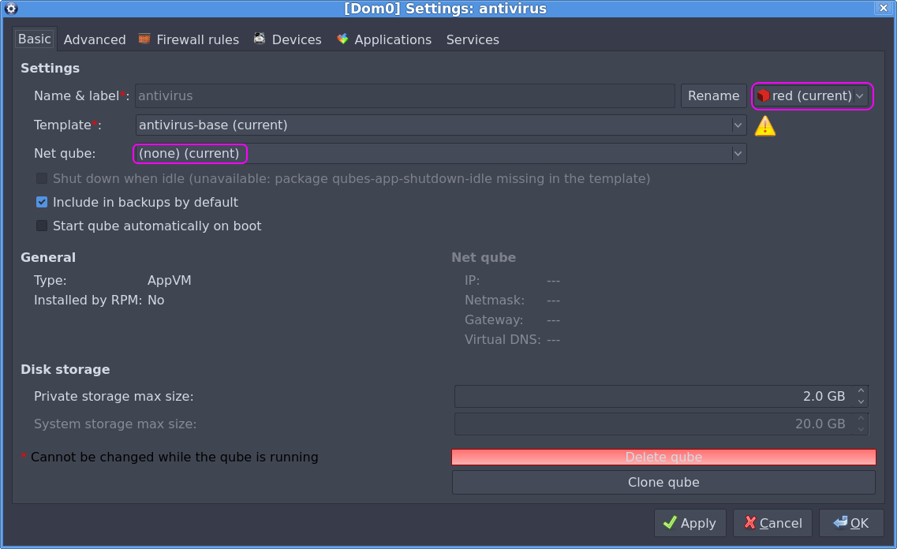
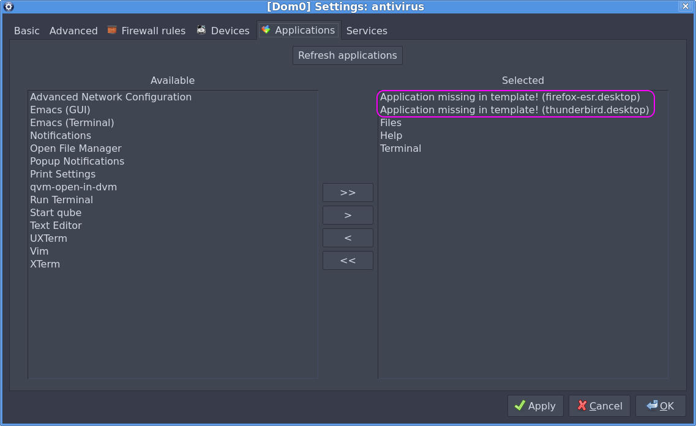
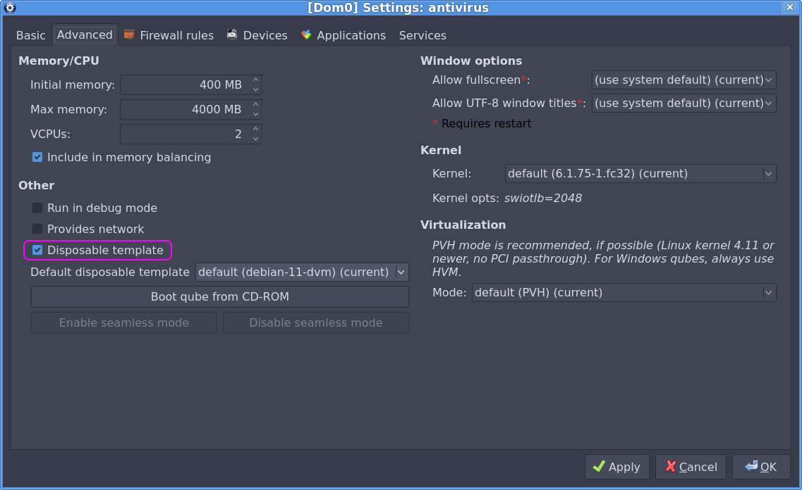
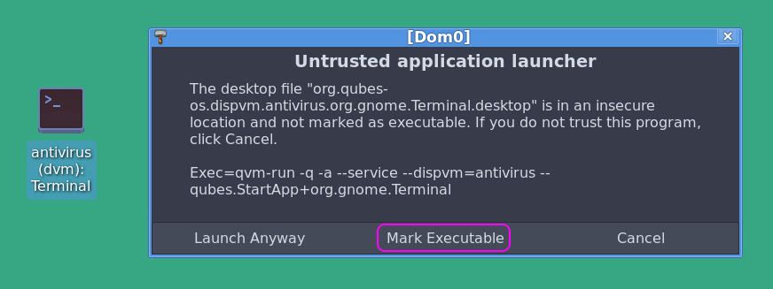
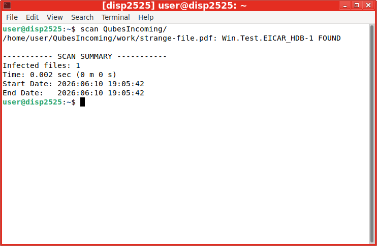

# Антивирус в «песочнице»

Антивирусы в Linux, хоть и обитают в основном на серверах, перестали быть диковинкой. И, в отличие
от Windows, не сращиваются с операционной системой, а работают как отдельностоящие программы с
невысокими привилегиями. Подход со сканированием в «песочнице» напрашивается сам собой.
А [Qubes OS](https://www.qubes-os.org/), наряду с Docker-контейнерами и полновесными виртуальными
машинами, подходит для этого очень хорошо.

Играть в кубики

## Несколько замечаний

Qubes OS – не очередной дистрибутив, а настоящая операционная система, которая может запускать
другие операционные системы. Но речь пойдёт только о Linux.

Всё изложенное в статье делалось давно. С тех пор много воды утекло. Qubes OS версии 4.1
состарилась. Официальный сайт антивируса ClamAV ([www.clamav.net](https://www.clamav.net/)) и
серверы обновлений стали недоступны (по крайней мере, из Беларуси).

Ещё немного терминологии.
[Глоссарий](https://doc.qubes-os.org/en/latest/user/reference/glossary.html)
прекрасен в своей точности и полноте. Мы лишь слегка его русифицируем:

* [qube](https://doc.qubes-os.org/en/latest/user/reference/glossary.html#term-qube) - куб;
* [template](https://doc.qubes-os.org/en/latest/user/reference/glossary.html#term-template) -
  шаблон;
* [disposable](https://doc.qubes-os.org/en/latest/user/reference/glossary.html#term-disposable) -
  одноразовый куб, «песочница»;
* [disposable template](https://doc.qubes-os.org/en/latest/user/reference/glossary.html#term-disposable-template) -
  шаблон одноразового куба.

## Готовим шаблон антивируса

Выходим на рабочий стол, нажимаем **Alt** + **F2**. В появившемся окошке *Application Finder*'а
вводим `xfce4-terminal`, нажимаем **Enter**:


Откроется эмулятор терминала главного куба – так называемого
[dom0](https://doc.qubes-os.org/en/latest/user/reference/glossary.html#term-dom0):


Выясним, какие шаблоны уже имеются в нашем распоряжении (как видно из приглашения `@dom0`, команда
вводится и выполняется в кубе **dom0**.):

```
[dom0@dom0 ~]$ qvm-ls \
> --fields name,class | \
> grep TemplateVM
debian-11               TemplateVM
fedora-34               TemplateVM
whonix-gw-16            TemplateVM
whonix-ws-16            TemplateVM
```

Шаблоны *whonix-* нам не подходят, т.к. они предназначены для работы с
[TOR](https://ru.wikipedia.org/wiki/Tor). Возьмём *debian-11* (с таким же успехом можно было бы
взять *fedora-34*). Это шаблон из штатной поставки ОС. В нём нет ничего лишнего. Самое то в качестве
основы.

Создадим шаблон *antivirus-base* на основе *debian-11*:

```
[dom0@dom0 ~]$ qvm-clone \
> --class TemplateVM \
> debian-11 \
> antivirus-base
antivirus-base: Cloning private volume
antivirus-base: Cloning root volume
```

Назначим ему метку зелёного цвета:

```
[dom0@dom0 ~]$ qvm-prefs \
> antivirus-base \
> label green
```

Цвета –
[основа графического интерфейса Qubes OS](https://doc.qubes-os.org/en/r4.3/introduction/getting-started.html#color-security).
Как правило, самый безопасный куб – чёрного цвета. Самый опасный – красного. Но в целом выбор цвета
произволен. Мы выбрали зелёный, потому что собственно шаблон антивируса не несёт угрозы. В то же
время этот шаблон так или иначе будёт иметь доступ к Интернету в обход
[штатного механизма обновлений](https://doc.qubes-os.org/en/latest/user/how-to-guides/how-to-update.html)
Qubes OS. Но об этом [позже](#signatures-update).

И всё же, есть в *debian-11* кое-что ненадобное. Например, при работе с антивирусом совершенно не
требуются веб-браузер, почтовый клиент и т.д. Запустим эмулятор терминала новоиспеченного шаблона:

```
[dom0@dom0 ~]$ qvm-run \
> antivirus-base \
> gnome-terminal
```

Откроется привычное окно, только с зелёной рамкой:


Удалим ненужные пакеты (на самом деле, можно безболезненно удалить ещё с десяток):

```
user@antivirus-base:~$ sudo apt purge \
> firefox-esr \
> thunderbird \
> evince \
> keepassxc
```

Что это дало? Во-первых, уменьшилась так называемая
[поверхность атаки](https://ru.wikipedia.org/wiki/%D0%9F%D0%BE%D0%B2%D0%B5%D1%80%D1%85%D0%BD%D0%BE%D1%81%D1%82%D1%8C_%D0%B0%D1%82%D0%B0%D0%BA%D0%B8).
Заодно освободилось 500 мегабайт дискового пространства.

Установим антивирус ClamAV в шаблон, репозитории Debian работают-то исправно:

```
user@antivirus-base:~$ sudo apt install \
> clamav \
> clamav-daemon \
> clamav-doc \
> clamav-freshclam
```

Пакет *clamav-daemon* содержит демон антивируса, основное преимущество которого – многопоточность (в
пакете *clamav* имеется лишь однопоточный сканер).

Офф-лайн документация из пакета *clamav-doc* пригодится в наши непростые времена.

Пакет *clamav-freshclam* нужен для онлайн-обновлений. С ними мы позже
[(не)разберёмся](#signatures-update).

Для удобства добавим в */etc/bash.bashrc* (тут много вариаций допустимы, мне было проще сделать
именно так) алиас, чтобы не набирать каждый раз полную команду сканирования вручную. На мой взгляд,
это оптимальный вариант сканирования:

```bash
alias scan='clamdscan --fdpass --multiscan --verbose'
```

Остановим шаблон, чтобы все наши действия возымели эффект на создаваемые впоследствии кубы.

```
[dom0@dom0 ~]$ qvm-shutdown antivirus-base
```

Шаблон почти готов.

<anchor>signatures-update</anchor>

## Отступление по поводу обновлений сигнатур

Перед первым запуском сканера необходимо обновить сигнатуры: их просто нет в репозиториях Debian.

Как я это делал раньше, то есть до санкций-шманкций? Подключал шаблон *antivirus-base* к Интернету,
хоть поступать так крайне
[не рекомендуется](https://doc.qubes-os.org/en/latest/user/how-to-guides/how-to-install-software.html#why-don-t-templates-have-normal-network-access).

Но лёгкого пути нет. Нужно или дорабатывать
[updates proxy](https://doc.qubes-os.org/en/latest/user/how-to-guides/how-to-install-software.html#updates-proxy) (
штатный механизм обновлений Qubes OS ни о каком ClamAV не знает), или паковать сигнатуры вручную.

С другой стороны, что может случиться страшного, если запустить эмулятор терминала, выполнить в нём
команду
`systemctl restart clamav-freshclam.service`, проверить на всякий случай командой
`systemctl status clamav-freshclam.service` и больше **ничего не делать**? Я думаю, всё будет в
порядке. Не зря же мы предварительно вычистили шаблон от ненужных программ.

Так что подключаем к сети:

```
[dom0@dom0 ~]$ qvm-prefs \
> antivirus-base \
> netvm sys-firewall
```

Теперь об обходе блокировок. Пустить в Qubes OS трафик через
[TOR](https://www.whonix.org/wiki/Qubes) – не проблема. Да и с VPN особых трудностей не возникает.

В нашем случае будет достаточно «подкинуть» сигнатуры вручную. У себя в закромах я их откопал и
выложил на [GitHub](https://github.com/flaz14/habr/tree/main/antivirus/signatures).

<spoiler title="Страждущий да соберёт всё воедино.">

По-хорошему, нужно было разместить сигнатуры в репозитории как есть. Но для этого пришлось бы мне
повозиться с [Git Large File Storage](https://github.com/git-lfs/git-lfs#getting-started)
ввиду лимитов GitHub'а. Но я подумал: а кому реально нужно старьё?

Так что придётся скачать отдельные файлы. Затем склеить их:

```bash
cat signatures.tar.01  signatures.tar.02  signatures.tar.03  signatures.tar.04  signatures.tar.05 > signatures.tar
```

Потом распаковать:

```commandline
tar xvf signatures.tar
```

И поместить в каталог */var/lib/clamav* шаблона *antivirus-base*, чтобы получилась такая картина:

```
user@antivirus-base:~$ ls -alh /var/lib/clamav
total 361M
drwxr-xr-x  2 clamav clamav 4.0K Jun 10 18:11 .
drwxr-xr-x 47 root   root   4.0K Jun 10 17:43 ..
-rw-r--r--  1 root   root   1.4M Jun 10 18:11 bytecode.cld
-rw-r--r--  1 root   root   197M Jun 10 18:11 daily.cld
-rw-r--r--  1 root   root   163M Jun 10 18:11 main.cvd
```

</spoiler>


На всякий случай, проверим:

```
user@antivirus-base:~$ systemctl start clamav-daemon.service
user@antivirus-base:~$ systemctl status clamav-daemon.service 
● clamav-daemon.service - Clam AntiVirus userspace daemon
     Loaded: loaded (/lib/systemd/system/clamav-daemon.service; enabled; vendor preset: enabled)
    Drop-In: /etc/systemd/system/clamav-daemon.service.d
             └─extend.conf
     Active: active (running) since Wed 2026-06-10 18:12:20 +03; 44s ago
TriggeredBy: ● clamav-daemon.socket
       Docs: man:clamd(8)
             man:clamd.conf(5)
             https://docs.clamav.net/
    Process: 6018 ExecStartPre=/bin/mkdir -p /run/clamav (code=exited, status=0/SUCCESS)
    Process: 6019 ExecStartPre=/bin/chown clamav /run/clamav (code=exited, status=0/SUCCESS)
   Main PID: 6020 (clamd)
      Tasks: 2 (limit: 4620)
     Memory: 1.2G
        CPU: 14.253s
     CGroup: /system.slice/clamav-daemon.service
             └─6020 /usr/sbin/clamd --foreground=true
user@antivirus-base:~$ scan .
/home/user: OK

----------- SCAN SUMMARY -----------
Infected files: 0
Time: 0.365 sec (0 m 0 s)
Start Date: 2026:06:10 18:13:09
End Date:   2026:06:10 18:13:09
```

Не помешает заглянуть в конфигурацию */etc/clamav/clamd.conf*. Там много чего интересного. Так, по
умолчанию сканируются только файлы объемом не больше 25 мегабайт. Что-то я настраивал, пусть
[валяется](https://github.com/flaz14/habr/blob/main/antivirus/clamd.conf).

## Создаём шаблон для одноразовых кубов

Шаблон для одноразовых кубов – это никакой не шаблон на самом деле, а самый обычный куб с вручную
«подкрученным» свойством [template_for_dispvms](#template_for_dispvms):

```
[dom0@dom0 ~]$ qvm-create \ 
--class AppVM \
--template antivirus-base \
--label red \
antivirus
```

Параметр `--class AppVM` предписывает создать обычный куб. С выбором шаблона всё понятно. А цвет
красный, потому что куб опасный: в нём обитают потенциально заражённые файлы.

Отрубаем выход в сеть, она не нужна «песочнице» от слова совсем:

```
[dom0@dom0 ~]$ qvm-prefs \
> antivirus \
> netvm ""
```

<anchor>template_for_dispvms</anchor>
Наконец, превратим куб в одноразовый:

```
[dom0@dom0 ~]$ qvm-prefs \
> antivirus \
> template_for_dispvms on
```

И сделаем его видимым из GUI:

```
[dom0@dom0 ~]$ qvm-features \
> antivirus \
> appmenus-dispvm on
```

Зайдём в свойства куба, просто для подстраховки. Нажимаем на кнопку **Q**
(совсем как кнопка «Пуск» в Windows). Далее *Template (disp): antivirus* → *antivirus: Qube
Settings*. Откроется окно настроек куба:



Как видим, сеть и цвет настроены правильно. Жёлтый треугольник с восклицательным знаком всего лишь
предупреждает о том, что в кубе имеются ярлыки несуществующих приложений (удаление пакета
посредством *apt* не удаляет ярлыки). Их можно удалить вручную, перейдя на вкладку
*Applications*:



А на вкладке *Advanced*, можно убедиться, что наш куб является шаблоном для одноразовых кубов:



Осталось вынести ярлык «песочницы» на рабочий стол. Щелкаем по кнопке **Q**, наводим курсор на пункт
*Template (disp): antivirus*, в выпавшем подменю находим *antivirus: Terminal*, хватаем этот пункт
мышью и тащим на рабочий стол.

## Проверяем

Пусть у нас есть куб *work* с выходом в Интернет, находясь в котором мы побродили по Сети и скачали
подозрительный *strange-file.pdf* следующего содержания (на самом деле, это
безобидный [EICAR-Test-File](https://ru.wikipedia.org/wiki/EICAR-Test-File)):

```
X5O!P%@AP[4\PZX54(P^)7CC)7}$EICAR-STANDARD-ANTIVIRUS-TEST-FILE!$H+H*
```

Нам нужно проверить его на наличие вирусов. Для этого дважды щёлкаем на ярлыке антивируса
(заодно отмечаем ярлык исполняемым):



Запустится эмулятор терминала одноразового куба с антивирусом. Имя у него будет вида *dispXXXX*. В
данном случае, *disp2525*. Возвращаемся в куб *work*.
[Копируем](https://doc.qubes-os.org/en/development/user/how-to-guides/how-to-copy-and-move-files.html)
подозрительный файл из куба *work* в одноразовый куб **disp2525**.

Переходим в терминал одноразового куба. Набираем `scan QubesIncoming` и смотрим на результат:



Если файл заражён (в нашем случае EICAR-файл всегда будет выглядеть зараженным, хотя это всего лишь
текст), то просто закрываем окно консоли антивируса. Одноразовый куб тут же уничтожится, а вместе с
ним сотрётся просканированный файл. Останется лишь удалить оригинал в кубе *work*.

Если файл не заражён, то всё равно закрываем окно **disp2525**: антивирус нам больше не нужен,
оригинал остался в кубе *work*.

Почему же мы в «песочнице» сканируем каталог *QubesIncoming* целиком? Да потому что перед
копированием одноразовый куб чист, и нет нужды заходить глубже. Так, скопированный из куба *work*
файл *strange-file.pdf* окажется по адресу */home/user/QubesIncoming/work/strange-file.pdf*.

## Именованные одноразовые кубы

Кроме одноразовых кубов с невнятными именами вида *dispXXXX*, есть
[именованные одноразовые кубы](https://doc.qubes-os.org/en/latest/user/reference/glossary.html#term-named-disposable)
(самые яркие примеры – *sys-net* и *sys-firewall*). Они не привязаны к программе, вместе с которой
были запущены. Скажем, запустили мы эмулятор терминала одноразового куба и тут же его закрыли. Всё,
куб уничтожился. А именованный одноразовый куб продолжит работу до явно отданной команды на останов.
Или до завершения работы ОС в целом.

Годится ли такой подход для антивируса? Сложно сказать. С одной стороны, работающий куб с конкретным
именем **antivirus** снижает вероятность того, что потенциально заражённый файл попадёт (в силу
опечатки) в неподходящий куб. Плюс экономия времени на запуск, экономия памяти.

С другой стороны, когда все сканирования делаются в одной «песочнице», эта самая песочница перестаёт
быть таковой. То есть если вдруг вирус в сканируемом файле поимеет антивирус, то сможет заразить
вообще всё, что за данный сеанс через антивирус пройдёт.

## Заключение

Воистину, дорога ложка к обеду. Всё забывается, течёт, изменяется...

Вирусы тоже появляются, устаревают, исчезают. Вряд ли ClamAV спасёт от продвинутой заразы. Но старых
вирусов с ним можно не опасаться. А если учесть встроенные в Qubes OS механизмы изоляции, боятся
вообще нечего.

## P.S.

После обновлений Qubes OS (по крайне мере, версия 4.1) не делает `apt autoremove`. Так что если
вдруг вылезла ошибка, что какой-то там куб is running out of storage space, то первое, что нужно
сделать – открыть его терминал и вбить `sudo apt autoremove`. Я так поступаю после каждого
обновления системы. На самом деле, через два или даже через три, ибо каждый раз муторно :)
